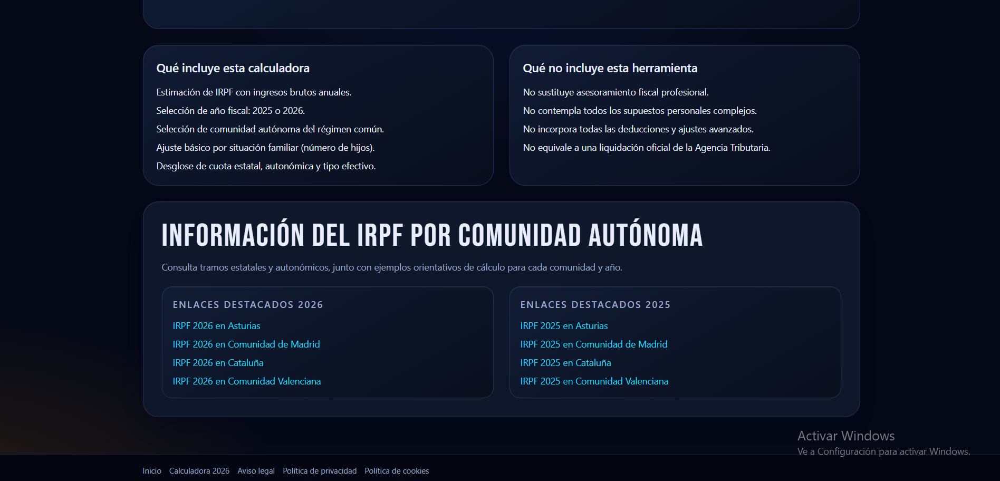
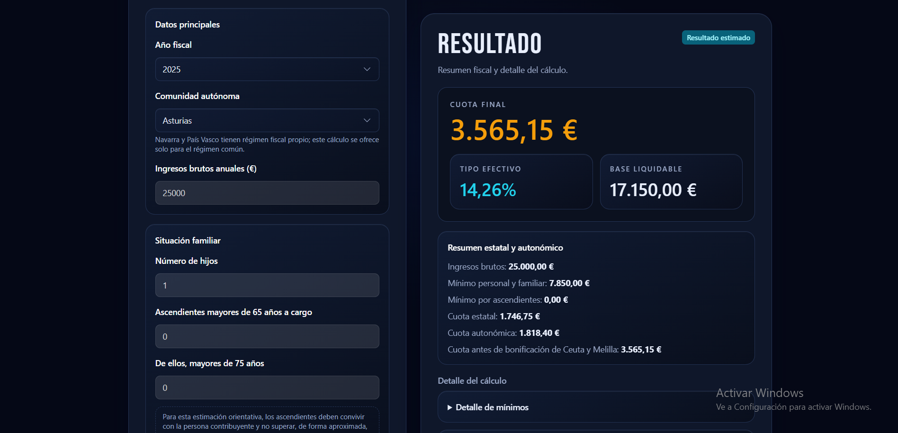
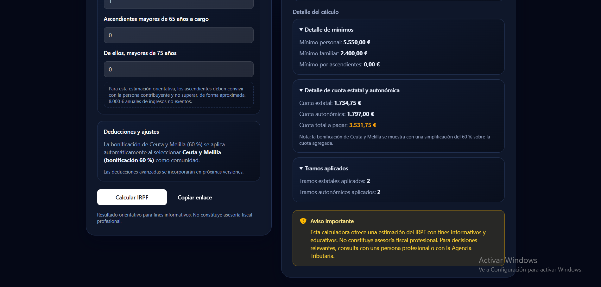
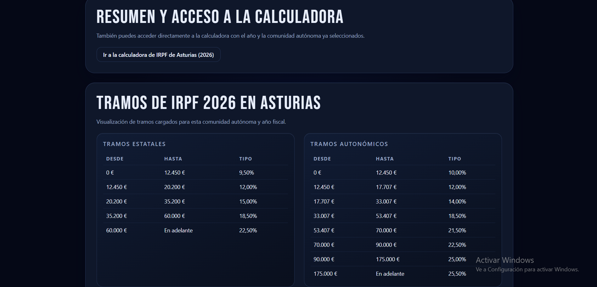
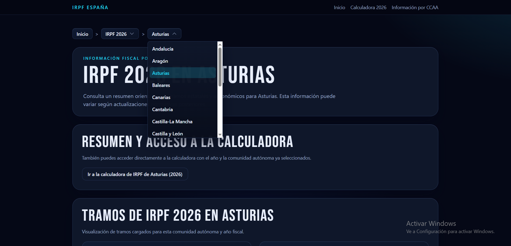

# IRPF Calculator

English version: [README.en.md](README.en.md)

## Objetivo
Aplicación para calcular IRPF en España con renderizado del lado del servidor (SSR), interfaz reactiva con Livewire y componentes UI con Flux.

## Stack tecnológico
- Laravel 12
- Livewire 4
- Flux UI Free v2
- PHP 8.2
- Vite + Tailwind CSS
- PHPUnit
- Laravel Pint
- Laravel Boost / MCP

## Requisitos
- PHP 8.2+
- Composer
- Node.js + npm
- Entorno local con XAMPP (Apache/PHP/MySQL según tu configuración)

## Ejecución local
```bash
composer install
npm install
npm run dev
```

Opciones para levantar la app:
```bash
php artisan serve
```
o servir el proyecto con Apache en XAMPP.

## Calidad
```bash
composer test
```

Comandos opcionales (si están definidos en `composer.json`):
```bash
composer lint
composer analyse
```

## Capturas de pantalla
Las capturas están en `screenshots/` (raíz del proyecto).

### Home



### Calculadora



### Información por comunidad

